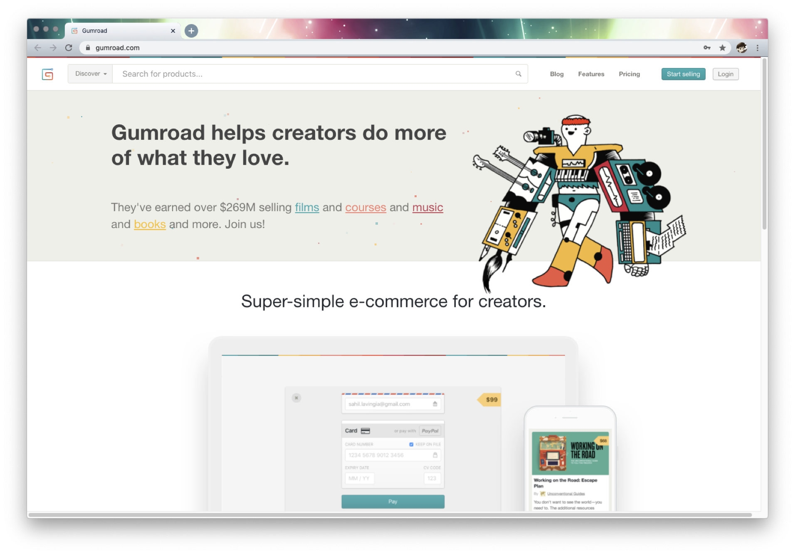

# 个人支付解决方案

略过开发环节（开发放到第二轮），我们直接进入变现环节。绝大部分的支付方案都是面向企业的，面向个人的正规支付方案非常少。那么对于没注册公司的个人，怎么样才能比较安全地收款呢？

## 常见的几种个人收款方式

### 个人收款码

市面上最简单粗暴的个人收款方案，就是利用微信或者支付宝的个人收款码来做。

具体的说，就是生成一张二维码，在这个二维码上面添加一个付款的备注，让用户备注中补充上特定的消息后（比如订单号）支付。当完成支付以后，我们就会通过APP或者网站，得到备注里面填的消息，通过识别，我们就能定位到订单，从而自动发货。也有不用备注，用支付金额来识别的。

这个方式淘宝店家已经用了很多年，它的问题就在于，从用户端的体验来讲，它需要填写额外的消息或者发送不确定的金额。从商家端的体验来讲，它需要有一个常驻的服务，随时去监测收款的相关消息，这就会有相当的不稳定因素在里边。

### 二次封装接口

另一种解决方案，就是由那些有资质的企业申请到接口权限后，二次封装后提供给个人来用。这种方案的问题在于，钱是支付给提供接口的企业的，我们只能定期找他们结算提款。万一对方跑路了，我们的钱也就没了。这种方式风险非常高，不推荐。

### 小微商户

「小微商户」是支付平台针对个人、也就是大量没有企业资质的用户推出的一个解决方案。最开始推出的时候，是为了帮助一些线下的店面，快捷地接入支付而存在的一个服务，然后又扩展到了网上的网店和商家。

一些银行和微信都有这个服务。但是微信并没有给它做专门的后台页面，所以我们在支付平台的后台里是看不见它的，它只有API。

微信把这一部分业务，交给了微信开放平台上的服务商。由服务商去调用这些接口来帮助个人接入到微信的支付服务里面来，同时服务商会提供后台的页面帮个人用户进行管理、也是服务商封装API供个人使用。

这种方案它的好处在于，它是完全合规的，而且这个钱是从微信直接打到小微商户的银行卡里边，不经过中间服务商，所以非常安全。

目前国内有名一点比如 xorpay.com 和 payjs.cn 。他们都是收费服务，前者的费用似乎更为便宜一些。这两个业务我们了解不多，大家使用之前请自行判断其靠谱系数。

## 数字内容销售平台

如果我们就是写一个软件，想简单地进行销售获得收入的话，我们还可以使用一些现成的数字内容销售平台。面向国外市场的话，可以使用Gumroad.com；如果面向国内市场的话，可以使用mianbaoduo.com。

  

逻辑上讲，所有的网店都能解决我们卖软件的需求，但相对而言，面包多这类专门面向数字商品的平台提供了更低的手续费和更为全面的 API 接口。

  
